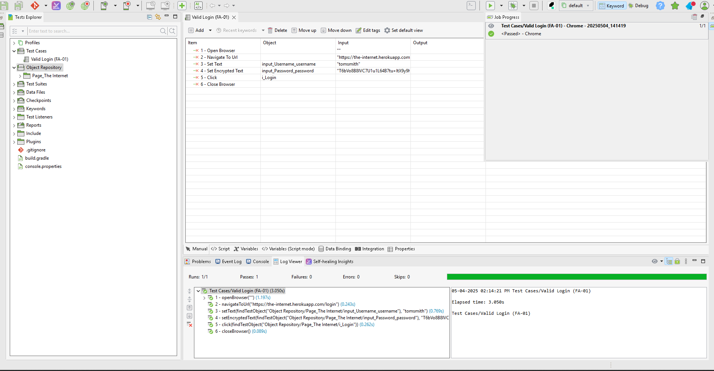

# QA-Demo
A mini QA demo project showcasing manual test planning, test case writing, and bug reporting for a sample web application. Created for my second-round QA Analyst interview at Carebook.

# QA Demo Project – [The Internet by Heroku]

## Overview
This is a mini QA demo project created to demonstrate how I approach manual testing, test case documentation, and bug reporting. It was built specifically in preparation for my second-round interview for the QA Analyst role at Carebook.

## Test Target
Sample site used: [The Internet by Heroku](https://the-internet.herokuapp.com/)
A playground web app with sample pages for login forms, dropdowns, broken images, and dynamic notifications.

## What's Included
-  `Test-Plan.md` – High-level QA strategy and approach  
-  `Test-Cases.md` – Functional test cases with clear steps and outcomes  
-  *Test Cases/` + `Object Repository/` – Katalon Studio UI test (Valid Login)

## Tools Used
- **Manual testing:** Chrome Browser + Chrome DevTools  
- **Documentation:** Markdown (`.md` files)  
- **Version control & presentation:** GitHub  
- **Automation:** Katalon Studio

## Folder Structure

qa-demo/
├── Test-Plan.md # Manual test plan document
├── Test-Cases.md # Functional test cases (markdown)
├── Test Cases/ # Katalon Studio test case
├── Object Repository/ # Katalon test object mappings
├── README.md # This file

## How to Navigate
- Open **Test-Plan.md** to review scope, environment, and approach.  
- View **Test-Cases.md** to read the tested features and results.  
- Check **Bug-Reports.md** for real-world style issue tracking.  
- Katalon test can be opened in [Katalon Studio](https://katalon.com).

  ## Katalon Images

  - 

## Author
Joshua Beaton
